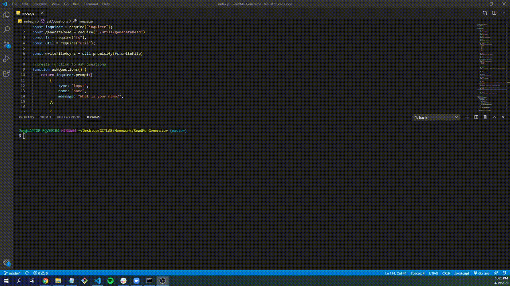

# Welcome to The ReadMe Generator

  
  
## Description
  
This application, powered by JavaScript and Node.js, will produce a usable README.md file for other programmers to use. Having a basic outline for a Markdown is extremely helpful.

## User Story

As a software developter, I want to generate ReadMe files, so that I can provide other users an overview of my work. 

  
## Table of Contents
* [Installation](#installation)
* [Usage](#usage)
* [License](#license)
* [Demo](#demo)
* [Questions](#questions)

  
## Installation

To use this application, run the following commands in your terminal to install the appropriate packages

    npm i inquirer

## Usage 

After you've installed the packages, The user opens up their terminal and runs the command
   
    node index.js

## License
 

## Demo

## Questions
  
If you see any improvements that can be made, please email me at joychen5069@gmail.com. You can also visit my GitHub page at https://github.com/joychen5069 or visit the gitHub page at https://github.com/joychen5069/ReadMe-Generator

  
